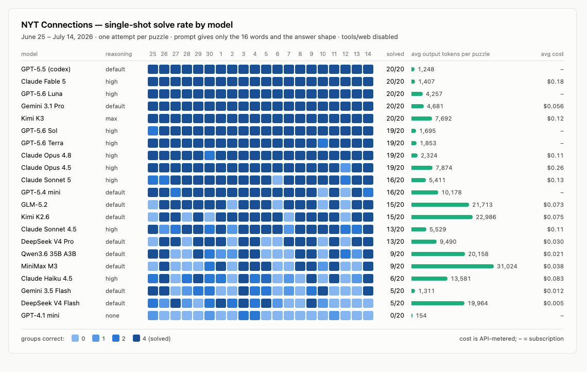

# connections-bench

Single-shot benchmark of LLMs on the NYT Connections puzzle: each model gets
**one attempt** to group the 16 words into the 4 official groups — no retries,
no feedback, no tools.

<picture>
  <source media="(prefers-color-scheme: dark)" srcset="assets/results-dark.png">
  
</picture>

## Results (June 25 – July 14, 2026)

| model | reasoning | solved | avg out tokens | avg cost/puzzle |
|---|---|---|---|---|
| GPT-5.5 (codex) | default | **20/20** | 1,248 | – (sub) |
| Claude Fable 5 | high | **20/20** | 1,407 | $0.18 |
| GPT-5.6 Luna | high | **20/20** | 4,257 | – (sub) |
| Gemini 3.1 Pro | default | **20/20** | 4,681 | $0.056 |
| Kimi K3 | max | **20/20** | 7,692 | $0.12 |
| GPT-5.6 Sol | high | 19/20 | 1,695 | – (sub) |
| GPT-5.6 Terra | high | 19/20 | 1,853 | – (sub) |
| Claude Opus 4.8 | high | 19/20 | 2,324 | $0.11 |
| Claude Opus 4.5 | high | 19/20 | 7,874 | $0.26 |
| Claude Sonnet 5 | high | 16/20 | 5,411 | $0.13 |
| GPT-5.4 mini | default | 16/20 | 10,178 | – (sub) |
| GLM-5.2 | default | 15/20 | 21,713 | $0.073 |
| Kimi K2.6 | default | 15/20 | 22,986 | $0.075 |
| Claude Sonnet 4.5 | high | 13/20 | 5,529 | $0.11 |
| DeepSeek V4 Pro | default | 13/20 | 9,490 | $0.030 |
| Qwen3.6 35B A3B | default | 9/20 | 20,158 | $0.021 |
| MiniMax M3 | default | 9/20 | 31,024 | $0.038 |
| Claude Haiku 4.5 | high | 6/20 | 13,581 | $0.083 |
| Gemini 3.5 Flash | default | 5/20 | 1,311 | $0.012 |
| DeepSeek V4 Flash | default | 5/20 | 19,964 | $0.005 |
| GPT-4.1 mini | none | 0/20 | 154 | – |

Reasoning levels aren't uniform, so the column is not an apples-to-apples knob:
`high` is pinned explicitly via `@high` in the model spec; `default` means the
benchmark passes no effort and takes whatever the CLI or provider chooses;
`none` is GPT-4.1 mini, which has no reasoning mode; `max` is Kimi K3, which
currently exposes only that one level.

Things the sweep surfaced:

- **Five models swept all twenty**: GPT-5.5 (codex), Claude Fable 5, GPT-5.6
  Luna, Gemini 3.1 Pro, and Kimi K3 (open-weight). The GPT-5.6 family went 58/60
  across its three variants.
- **Gemini 3.1 Pro is the cheapest perfect score** — 20/20 at $0.056/puzzle, less
  than half of Kimi K3 and a third of Claude Fable 5, and fastest of the sweepers
  at 39s. It ran at OpenRouter's default effort; the pinned-`high` Claude and GPT
  flagships had no edge on it here.
- **Puzzle difficulty swings hard day to day** — July 12 beat all but 7 of 21
  models, while July 3 and July 9 fell to all but one or two. Single-day
  comparisons are noise, and even twenty days is a small sample.
- **Reasoning is the entry ticket, and effort level gates it.** GPT-4.1 mini (no
  reasoning) answers in ~150 tokens and went 0/20. Gemini 3.5 Flash at its default
  medium effort mostly answered in ~200 tokens too and managed 5/20 — the same
  model family as the 20/20 Pro, separated largely by how much it was allowed to
  think. Every model that deliberates at length solves most puzzles.
- **Capability shows up as token efficiency, not just accuracy.** The perfect
  scorers average 1.2–7.7k output tokens; mid-tier models burn 20–31k for half
  the solve rate. Token count tracks *how hard the puzzle is for that model*, not
  effort spent well: K3 ranged from 845 tokens to 32k across the twenty days.
- **The open-weight gap has closed, at least here.** Kimi K3 swept all twenty —
  matching GPT-5.5, Fable 5 and GPT-5.6 Luna, and beating every Claude and the
  other two GPT-5.6 variants. It did it on a third of the thinking tokens its
  predecessor K2.6 needed (7.7k vs 23k) for a 5-puzzle better score. Prior
  open-weight best was GLM-5.2 at 15/20.
- **DeepSeek V4 Pro is the value pick** — 13/20 at $0.030, a quarter of K3's cost.

## How it works

- **Puzzles** come from NYT's public JSON endpoint
  (`https://www.nytimes.com/svc/connections/v2/<YYYY-MM-DD>.json`), cached in
  `puzzles/` (gitignored). Any date since 2023-06-12 works.
- **The prompt is deliberately bare** — the 16 words in board order plus the
  answer shape, nothing else. No rules, no "4 groups of 4", no red-herring
  warning (early testing showed those hints measurably help weaker models):

  ```
  Solve the puzzle:

  <the 16 words, one per line>

  Respond with ONLY a JSON object, no other text:
  {"groups": [{"theme": "...", "words": ["...", "..."]}, ...]}
  ```

- **Runners** (specs are `runner[:model][@effort]`):
  - `claude:<model>[@effort]` — `claude -p --tools ""` (Claude Code CLI, all tools disabled)
  - `codex[:<model>][@effort]` — `codex exec --sandbox read-only -c tools.web_search=false`
    on the ChatGPT account
  - `codex-api:<model>` — same, but with an isolated `CODEX_HOME` using
    `OPENAI_API_KEY` (unlocks models the ChatGPT plan rejects)
  - `openrouter:<model-id>` — direct chat-completions API call (no agent harness)
- **Anti-cheat**: answers for a given day are published all over the web, so
  web search and tools are disabled in every runner.
- **Grading** ignores theme labels. Solved = all four 4-word groupings match
  exactly. Partial credit recorded as `correct_groups` (0, 1, 2, or 4 — three
  correct implies four).
- **Records**: every attempt appends to `results/runs.jsonl` with token counts
  (in/cached/out/reasoning), cost where the API reports it, duration, the parsed
  guess, the raw response, and a `prompt_v` tag so prompt revisions never mix.

## Usage

```sh
./bench.py run --date 2026-07-04                 # roster from models.txt
./bench.py run --start 2026-06-25 --end 2026-07-04 --jobs 6
./bench.py run --start 2026-06-25 --end 2026-07-04 --models codex:gpt-5.5 --missing --no-record
./bench.py run --date 2026-07-09 --models codex:gpt-5.6-sol@high,codex:gpt-5.6-terra@high,codex:gpt-5.6-luna@high
./bench.py run --date 2026-07-04 --models claude:haiku@low,openrouter:z-ai/glm-5.2
./bench.py summary                               # leaderboard table
python3 viz.py                                   # regenerate viz.html
```

Keys: `OPENROUTER_API_KEY` and `OPENAI_API_KEY` from the environment or a
gitignored `.env`. Attempts already recorded for a (date, model, prompt-version)
are skipped; `--rerun` forces. Errored attempts retry automatically on the next
run. GPT-5.6 requires Codex CLI 0.144.0 or newer.

`--missing` is a harder variant that always removes the first word in board
order. The prompt only says that one word is missing and asks the model to group
the 15 shown words; grading expects three groups of four and one group of three.
Use `summary --missing` to keep its results separate from the standard benchmark.

The figure: `python3 viz.py` then
`npx playwright screenshot --viewport-size "1140,725" --color-scheme light viz.html assets/results-light.png`
(and again with `dark`).

## Caveats

- **Training-data contamination**: puzzles before each model's cutoff may have
  been memorized. All dates here (mid-2026) post-date every tested model's
  cutoff, but be careful benchmarking the 2023–2024 archive.
- **Harness asymmetry**: claude/codex attempts run inside their agent CLIs
  (system prompts included); OpenRouter attempts are raw API calls.
- **Costs**: claude numbers are the CLI's API-metered figure (notional if you're
  on a subscription); codex ChatGPT-account runs don't report cost; OpenRouter
  is exact.
- One attempt per (date, model) — solve rates on 20 puzzles carry ±1-puzzle
  noise; treat close rankings as ties.
- **Errors count as failures, so a flaky transport can silently libel a model.**
  Kimi K3 released mid-sweep and OpenRouter rate-limited it in bursts; for two
  days it recorded 3–7 "failures" that were HTTP 429s rejected in under a second,
  before the model ran at all. At its worst the table showed K3 at 3/10. It was
  really 20/20. Nothing about the model changed — only `run_openrouter` learning
  to back off (see `RATE_LIMIT_RETRIES`) and `--timeout` going to 3600s. Treat
  any error-flagged row as unproven rather than bad, and re-run it before
  believing it.
- **Kimi K3 is slow because it thinks, not because it's loaded.** Throughput is a
  near-constant 35.5 tok/s (stdev 2.5) and duration correlates with output tokens
  at r=0.998 — its 978s run is 32k tokens at the same rate as its 24s / 845 token
  run. So `--timeout 900` is too tight: a 978s *solve* is in the data, and a
  harder puzzle would be scored a failure it didn't earn. K3 needs
  `--timeout 3600`. (K2.6 swings 45–171 tok/s, which does look like contention.)
- **OpenRouter pads slow non-streaming responses** with whitespace keepalives
  while waiting on the provider. `json.loads` skips them, but if the provider
  never answers, padding is all you get. `run_openrouter` reports that as
  "no payload" rather than a confusing `JSONDecodeError` at the end of the body.
  Note also that `urlopen`'s timeout is per-socket-operation, so padding would
  reset it forever; `read_with_deadline` bounds the request on total elapsed
  time instead. That deadline is monotonic-clock based, so it does not count
  time the machine spends asleep.
